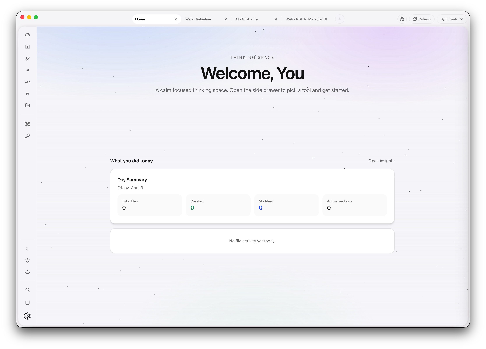
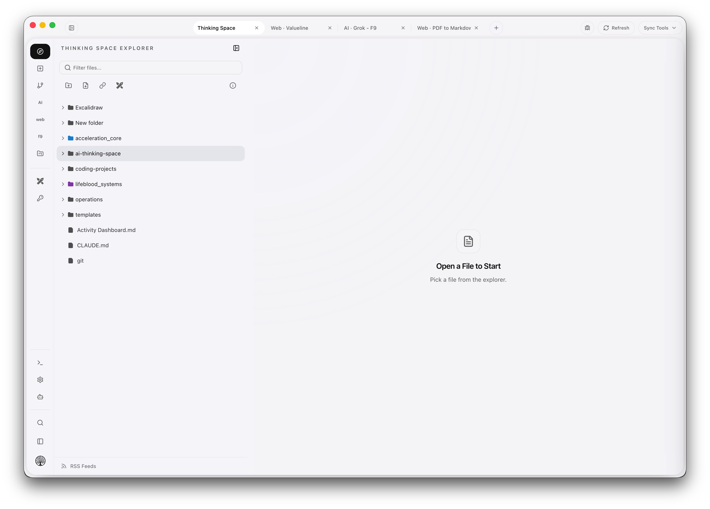
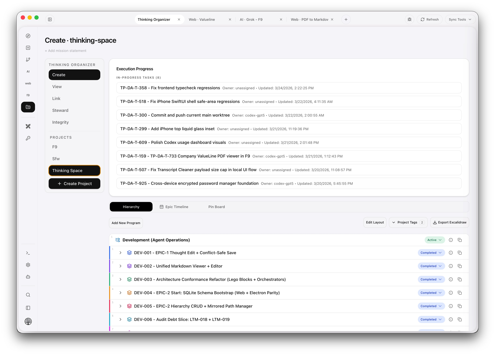

# Thinking Space

> A local-first thinking workspace where humans and AI work together on personal knowledge.

[-blue.svg)](LICENSE)
[]()
[]()

---

## Download

- macOS (Apple Silicon): [Thinking Space 2.6.0 arm64 DMG](https://github.com/anuragrpatil23/Thinking-Space/releases/download/v2.6.0/Thinking.Space-2.6.0-arm64.dmg)
- Windows (x64): [Thinking Space 2.6.0 x64 Setup](https://github.com/anuragrpatil23/Thinking-Space/releases/download/v2.6.0/Thinking.Space.Setup.2.6.0-x64.exe)
- iPhone / iPad: not yet distributed — the iOS app (Capacitor) builds from source via Xcode. There is no public install link yet; TestFlight distribution is planned.
- All release assets: [GitHub Releases](https://github.com/anuragrpatil23/Thinking-Space/releases)

---

## What Is This?

Thinking Space helps you turn a folder of notes into a practical, compounding long-term memory.

Most note-taking tools force you into rigid plugin systems and disconnected AI workflows. Thinking Space is different — it's built from the ground up as three things at once:

Your notes folder is the source of truth, and Thinking Space is the helpful layer on top that makes creation, management, and use easier with AI of your choice.

You can use an existing folder with your notes or create a new one. A cloud-synced folder is recommended so your notes are available across devices.

Thinking Space does not impose a fixed way of thinking or organization. Your structure is yours. It provides useful tools out of the box and removes repetitive parts of knowledge-base work so you can focus on actual thinking.

Thinking Space is source-available and designed to be extendable with AI. You can inspect the source code, add features, and shape the app to fit your workflow under the terms in [LICENSE](LICENSE).

- A chill markdown viewer — point it at a folder and read your notes
- A freeform **home canvas** — post-its, live vault notes, and web widgets on an infinite board
- An **AI Activity** dashboard that shows what you actually worked on with Claude, Codex, ChatGPT, Grok — and what you've been reading
- A small, extendable Electron app you can use as a home for the little tools you build for yourself
- Works alongside Obsidian — no conflicts
- Local-first and portable (plain Markdown + YAML)
- No lock-in to one AI provider
- iOS app that actually opens big vaults. Obsidian on my iPhone usually just spins forever — this one doesn't.

Humans are beautiful.

### Core Pillars

Thinking Space is built as three product pillars:

**A thinking space for individuals.** Capture structured thoughts in a natural hierarchy: Programs, Epics, Ideas, and Thoughts. Everything is local-first, stored as plain Markdown files with YAML frontmatter, and fully portable.

**A place where humans and AI work together.** AI writing assistance lives directly in your workspace — grammar, clarity, structure, and tone actions right where you're writing. Chat with AI models, configure providers, and track usage with built-in telemetry.

**An AI agent management space.** Manage agent tasks, track runs and handoffs, and integrate AI output with your own thinking. A full capability system with 55+ typed operations, audit logging, and policy controls. Run AI agents (including Claude Code) inside the app's own terminal — and let them modify and rebuild the app itself.

---

## Product Demo

<!-- Replace with an actual screen recording when available -->

<p align="center">
  
  <br />
  <em>Home canvas — pixel-art ambient scene, draggable notes/widgets, and the AI Activity dashboard</em>
</p>

<p align="center">
  
  <br />
  <em>Markdown workspace with the local-first explorer and multi-tab desktop shell</em>
</p>

<p align="center">
  
  <br />
  <em>Organizer view for structured thinking and hierarchical knowledge management</em>
</p>

<details>
<summary><strong>Walkthrough</strong></summary>

### 1. Connect a Folder

Point Thinking Space at any folder on your machine — an existing notes vault, an iCloud directory, or a fresh folder. That folder becomes your Thinking Space. Everything is stored as plain Markdown files with YAML frontmatter, so your data is always yours.

### 2. Home Canvas

After connecting, you land on a freeform **home canvas** — an infinite board with a pixel-art ambient scene that greets you by name. Drop **post-its**, pin **live vault notes**, and add **web widgets** with per-tile auto-refresh, then pan/zoom with a minimap. On desktop the canvas is the default home; it doubles as your at-a-glance dashboard.

### 3. AI Activity

A dashboard for what you actually worked on with AI — **sessions, messages, and projects over time** across Claude, Codex, ChatGPT, and Grok, plus a **Reading** source that tracks GoodNotes reading sessions. Filter by source and date range, see a this-week digest, and drill into any day's chains. Activity heatmap, duration trend, and totals views included.

### 4. Thinking Space (Markdown Workspace)

The main workspace is a multi-document markdown editor with:
- A **file explorer** sidebar with folder color coding and icon style options
- **Tabbed editing** — open multiple documents side by side, tabs persist across sessions
- **Conflict-safe saves** with mtime/hash checks so you never lose edits
- **Obsidian wikilink** `[[navigation]]` — click through to linked notes
- **Native LaTeX (KaTeX) and TikZ (TikZJax)** rendering for math and diagrams
- **Ruled notebook** view and multiple reading layouts
- **AI writing actions** — highlight text and get grammar, clarity, structure, or tone suggestions with diff preview

### 5. New Note

Capture a thought quickly with emotion tags, type classification, and optional AI assistance. Notes land in your vault as Markdown files with structured YAML frontmatter.

### 6. AI Chat

Have a conversation with AI models directly inside the app:
- **Multi-provider**: OpenAI, Anthropic Claude, local models (LM Studio / OpenAI-compatible), Codex CLI
- **Streaming responses** with token/latency telemetry
- **Per-scope defaults** — set different models for different tasks

### 7. Thinking Organizer

A hierarchical tree view of your knowledge base: **Programs > Epics > Ideas > Thoughts**. Drag-and-drop to rearrange, create new nodes, reparent items. Hierarchy lives in YAML metadata, not folder structure — so your folders can be organized however you want.

### 8. Built-in Browser & Web

An in-app web browser with:
- **Bookmark management** with groups
- **Google Docs and Sheets** integration via OAuth
- **RSS feed reader** with retention controls, feed groups, and preset tags

### 9. Tools

Navigation folds AI, Web, and the utilities below into a single **Tools** toolbox (jump to any side-rail tab with Cmd/Ctrl + number):
- **Git Insights** — activity heatmap, weekly commit trends, contributor stats
- **PDF to Markdown** — extract content with layout preservation
- **Transcript Cleaner** — heading extraction and normalization
- **Excalidraw++** — full drawing canvas with pen defaults, scene management, and highlighter
- **Mindmap Builder** — convert hierarchical markdown into visual diagrams
- **Password Manager** — cross-device passphrase-encrypted vault

### 10. Schedules

Schedule recurring agent runs with a launchd-direct runner — no always-on server. Create/edit schedules from a sidebar, default new ones to **Claude Code** execution, and watch them via **live log streaming**, a transcript history viewer, and a heartbeat file. Optional **Telegram** resume loop and ntfy failure alerts keep you in the loop when you step away.

### 11. Embedded Terminal

A full VS Code-style terminal (xterm.js + node-pty) as a first-class nav item. Multi-tab, shells stay alive when switching pages. Run Claude Code or any CLI tool directly inside the app.

### 12. Settings

Configure everything: theme, explorer appearance, schedules, AI providers, markdown editor behavior, Google Workspace auth, RSS feeds, cache, and vault switching. A **Developer** tab lets you toggle Live Source Mode and trigger the rebuild pipeline.

</details>

---

## Quick Start

### Prerequisites

- [Node.js](https://nodejs.org/) v18+
- npm (comes with Node.js)

### Using the build script

```bash
git clone https://github.com/anuragrpatil23/Thinking-Space.git
cd Thinking-Space

# Install everything
./build.sh install

# Start the dev server
./build.sh dev
```

Opens at `http://localhost:5173` — pick a local folder as your vault and you're in.

### Other build commands

| Command | What it does |
|---|---|
| `./build.sh dev` | Start Vite dev server |
| `./build.sh web` | Build web/PWA bundle |
| `./build.sh electron` | Build & launch Electron app |
| `./build.sh mac` | Package macOS `.dmg` |
| `./build.sh win` | Package Windows installer |
| `./build.sh win-lite` | Package Windows x64 installer without embedded terminal |
| `./build.sh linux` | Package Linux `.AppImage` |
| `./build.sh ios` | Build for iOS + open Xcode |
| `./build.sh backend` | Start FastAPI backend (optional) |
| `./build.sh test` | Run frontend tests |
| `./build.sh clean` | Remove build artifacts |

---

## Tech Stack

| Layer | Technology |
|---|---|
| Frontend | React 18, TypeScript, Vite, Tailwind CSS |
| Desktop | Electron (via Capacitor) |
| Mobile | Capacitor (iOS) |
| Storage | YAML frontmatter in Markdown files (source of truth) |
| Cache | IndexedDB via Dexie.js (rebuildable) |
| AI | OpenAI, Anthropic, Open Source AI (LM Studio/OpenAI-compatible local), Codex CLI |
| Drawing | Excalidraw |
| Editor | CodeMirror |
| Terminal | xterm.js (`@xterm/xterm`) + node-pty (same stack as VS Code) |
| Backend | FastAPI + Python (optional, thin proxy) |

---

## Architecture

Thinking Space follows a **lego blocks + orchestrators** pattern:

- **Lego blocks** — small, reusable primitives (components, hooks, services)
- **Orchestrators** — page/feature containers that compose blocks and manage state

Data flows through:
1. **Markdown files** with YAML frontmatter (source of truth, portable, git-friendly)
2. **IndexedDB** cache for fast hierarchy queries (rebuildable from files)
3. **Capability system** for agent operations (55+ typed operations with policy/audit)

Hierarchy lives in metadata (`parent` fields), not folder structure — organize your vault however you want.

For detailed architecture docs, see:
- [DEVELOPMENT.md](DEVELOPMENT.md) — architecture contracts, storage strategy, implementation phases
- [docs/ADR-004-YAML-Architecture.md](docs/ADR-004-YAML-Architecture.md) — full YAML schema
- [docs/ADR-005-Agent-Capabilities.md](docs/ADR-005-Agent-Capabilities.md) — capability system
- [AGENTS.md](AGENTS.md) — agent operating contract

---

## Contributing

Contributions are welcome! The codebase follows strict placement and naming conventions — see [DEVELOPMENT.md](DEVELOPMENT.md) and [AGENTS.md](AGENTS.md) before making changes.

---

## License

AGPL-3.0 for non-commercial use. Commercial license required for any commercial use.

| Use Case | Allowed? |
| --- | --- |
| Personal / research / educational | Yes |
| Self-hosted (non-commercial) | Yes, with attribution |
| Fork and modify (non-commercial) | Yes, share source under AGPL-3.0 |
| Commercial use / SaaS / rebranding | Requires commercial license |

See [LICENSE](LICENSE) for full terms. For commercial licensing, contact the maintainer.

Copyright (C) 2024-2026 Elie Habib. All rights reserved.
